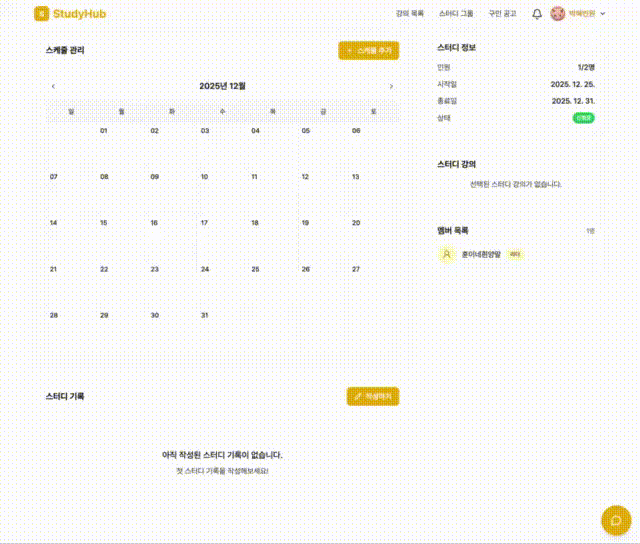

# StudyHub StudyGroup

> 온라인 강의와 스터디 문화를 결합한 IT 학습 플랫폼

- [StudyHub StudyGroup 배포 링크](https://study.ozcoding.site/)

 

| GitHub      | 이름   |
| ----------- | ------ |
| @miloupark  | 박혜빈 |
| @Jay-klmnop | 윤지예 |

 

## ✨ 주요 기능

### 스터디 그룹

- 검색
- 리뷰
- 강의 검색

### 스터디 그룹 상세

- 스케줄
- 기록
- 멤버 권한

### 기타

- 공통 컴포넌트
- 마크다운 에디터
- 채팅

 

## 🎬 화면 데모

| 스터디그룹 조회                                     | 스터디그룹 검색                                        | 스터디그룹 리뷰                                     |
| --------------------------------------------------- | ------------------------------------------------------ | --------------------------------------------------- |
|  |  |  |

| 스터디그룹 생성                                        | 스터디그룹 수정                                      | 마크다운 에디터                                |
| ------------------------------------------------------ | ---------------------------------------------------- | ---------------------------------------------- |
|  |  |  |

| 스터디그룹 스케줄                                   | 스터디그룹 기록                                | 채팅                                      |
| --------------------------------------------------- | ---------------------------------------------- | ----------------------------------------- |
|  |  |  |

 

## 🛠 기술 스택

### FE

 

 

 

## 📏 Project Convention

### Git Branch

| 종류        | 설명                 | 예시              | 설명               |
| ----------- | -------------------- | ----------------- | ------------------ |
| **main**    | 메인 브랜치          | main              | 그대로 사용        |
| **develop** | 배포 전 개발 브랜치  | develop           | 그대로 사용        |
| **feature** | 기능 개발 브랜치     | feature/10-signin | 로그인 기능 브랜치 |
| **hotfix**  | 디버깅 브랜치        | hotfix-1.1.4      | 1.1버전 디버깅     |
| **release** | 배포하기 위한 브랜치 | release-1.1       | 1.1 버전           |

 

### Commit Message

| Type         | 설명                                                 |
| ------------ | ---------------------------------------------------- |
| **feat**     | 새로운 기능 추가                                     |
| **fix**      | 버그 수정                                            |
| **refactor** | 리팩토링                                             |
| **design**   | CSS 및 사용자 UI 디자인 변경                         |
| **style**    | 코드 포맷팅, 세미콜론 누락, 코드 변경이 없는 경우    |
| **test**     | 테스트(테스트 코드 추가, 수정, 삭제)                 |
| **chore**    | 기타 변경사항 (빌드 스크립트 수정, 패키지 매니저 등) |
| **init**     | 프로젝트 초기 생성                                   |
| **rename**   | 파일 혹은 폴더명 수정 또는 이동                      |
| **remove**   | 파일을 삭제하는 작업만 수행한 경우                   |
